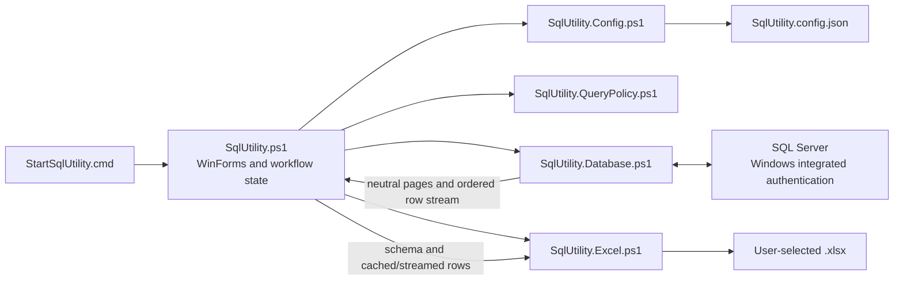

# SQL Utility

## Overview

SQL Utility is a portable internal Windows desktop application for connecting to Microsoft SQL Server with the signed-in user's Windows identity. It provides a deliberately restricted read-only query workspace, bounded result paging, and dependency-free `.xlsx` export.

Version 1 is intentionally small and synchronous. It is designed to be copied into a Citrix/cloud-drive environment and launched without installation, administrator access, executable compilation, or third-party packages.

## Version 1 Features

- Connection-first startup with blank Server and Database fields.
- Windows-authenticated connection testing and workspace entry.
- App-local persistence of successful server/database pairs and global settings.
- Saved-connection selection and confirmed deletion.
- Query and Settings tabs available after connection.
- One read-only `SELECT` statement over a primary named table with optional chained named-table `INNER JOIN` and `LEFT JOIN` clauses.
- Server-side paging for queries with a top-level `ORDER BY`.
- Bounded retrieval and local display paging for unordered queries.
- Fixed 500-row display pages.
- Explicit, on-demand exact row counts when a total is not already known from a complete unordered cache.
- Complete-result `.xlsx` export with a bold, filtered, frozen header row.
- Configurable unordered-row limit and Query/Export timeout.

## Requirements and Portability

The application targets Windows PowerShell 5.1 and .NET Framework components normally present in the Citrix environment:

- `System.Windows.Forms`
- `System.Drawing`
- `System.Data.SqlClient`
- `System.IO.Compression`
- `System.Xml`
- Built-in PowerShell JSON commands

It requires no installer, compiled `.exe`, administrator rights, third-party PowerShell module, NuGet package, Microsoft Office installation, `sqlcmd`, or Python runtime. It does not write to the registry or modify environment variables.

Microsoft Excel is not required to generate workbooks. Excel or another compatible spreadsheet application is needed only to open and visually inspect an exported `.xlsx` file.

## Portable Distribution

The runtime distribution contains exactly six files:

```text
StartSqlUtility.cmd
SqlUtility.ps1
modules/
  SqlUtility.Config.ps1
  SqlUtility.QueryPolicy.ps1
  SqlUtility.Database.ps1
  SqlUtility.Excel.ps1
```

Keep this structure intact. `SqlUtility.ps1` loads every module relative to its own directory, so the folder can be moved without installation or module registration.

`SqlUtility.config.json` is not part of the distribution. The application creates it beside `SqlUtility.ps1` only when a successful connection or settings change needs to be persisted.

## Running the Application

1. Extract or copy the complete application folder to the target environment. Do not run it from inside a ZIP archive.
2. Ensure the application directory is writable if saved connections or settings should persist.
3. Launch `StartSqlUtility.cmd`.

The launcher starts `powershell.exe` with:

```text
-NoLogo -NoProfile -STA -ExecutionPolicy Bypass
```

The execution-policy override is process-only. It does not change the machine, user, registry, or environment configuration. The launcher resolves `SqlUtility.ps1` beside itself even when it is started from another working directory.

## User Workflow

1. **Choose a connection.** Enter Server and Database manually, or select a saved pair from the list. Both input fields start blank on every launch; selecting a saved pair fills them without connecting automatically.
2. **Test or connect.** **Test Connection** validates the database and shows a success/failure pop-up without entering the workspace. **Connect** performs the same validation and then opens the workspace. A successful pair is added to the saved list and the application attempts to persist it.
3. **Manage saved pairs.** Select a saved pair and use **Delete**. Deletion requires confirmation and updates the active configuration only after a successful write.
4. **Run a query.** Enter an allowed SQL statement in the Query tab and select **Execute**. Results appear in a read-only grid below the editor. The single-line toolbar is ordered **Execute** | `ORDER BY required for paging.` | page status | **Count** | **<** | **>** | **Export**. The `<` and `>` controls mean Previous page and Next page; **Export** means Export to Excel.
5. **Page results.** Use `<` and `>`. The exact behavior depends on whether the executed query contains a top-level `ORDER BY`.
6. **Count rows when needed.** **Count** is always explicit; it never runs automatically during execution or paging. It is available only for a current successful result while the application is not busy and the editor is not stale. Complete unordered results already show their exact cached total and disable **Count**. Truncated unordered results show the configured retained limit with `+` until counted, while ordered results omit a total until **Count** succeeds; after counting an ordered or truncated result, **Count** remains available for an explicit refresh.
7. **Export a complete result.** Use **Export** when enabled and choose an `.xlsx` destination. The destination is never remembered.
8. **Change global settings.** The Settings tab controls the maximum unordered rows and Query/Export timeout. Changes become active only after **Save Settings** succeeds.
9. **Change connection.** **Change Connection** warns that the current SQL and results will be lost. Confirmation clears transient query state and returns to the connection stage; saved pairs and global settings remain.

The application does not keep an idle database connection open. Connection tests, query pages, and ordered exports open and deterministically dispose their own SQL resources.

## Architecture and Implementation



| File | Responsibility |
| --- | --- |
| `SqlUtility.ps1` | Creates WinForms controls, owns the one-line action layout, coordinates connection/query/count/settings/export workflows, owns application and explicit-count state, binds result pages, renders status, paging, and user messages, and caps displayed grid columns at 300 pixels. |
| `modules/SqlUtility.Config.ps1` | Creates defaults, validates schema and settings, loads/writes JSON safely, deduplicates saved pairs, and removes saved pairs. |
| `modules/SqlUtility.QueryPolicy.ps1` | Validates named sources, approved join chains, normalization, primary-table extraction, and top-level ordering; generates count-source/wrapper SQL. |
| `modules/SqlUtility.Database.ps1` | Builds integrated-security connection strings, tests connections, executes bounded queries and scalar counts, constructs neutral results, implements paging, streams ordered exports, enforces command timeouts, and owns SQL resource disposal. |
| `modules/SqlUtility.Excel.ps1` | Converts neutral schema/row input into a safe Open Packaging Convention `.xlsx`, enforces worksheet/text/timeout limits, and replaces the destination only after package completion. It never owns SQL connections. |

Interactive database operations return neutral `DataTable` and page-metadata objects; the database module never renders WinForms controls. Ordered export crosses a callback-based neutral schema/row boundary. Complete unordered export uses the bounded in-memory cache. This separation keeps SQL resource ownership in the database module and workbook generation in the Excel module.

The query workspace uses native Windows visual styles with Segoe UI 9-point interface chrome and a Consolas 10-point SQL editor. Its result splitter remains user-draggable. Result columns are sized from the currently displayed page and automatically capped at 300 pixels; horizontal scrolling remains available. No dark theme, external resource, or custom widget framework is added.

## Configuration and Persistence

The application stores configuration beside `SqlUtility.ps1`:

```text
SqlUtility.config.json
```

Schema version 1:

```json
{
  "schemaVersion": 1,
  "unorderedRowLimit": 1000,
  "queryExportTimeoutSeconds": 120,
  "connections": [
    {
      "server": "server-name",
      "database": "database-name"
    }
  ]
}
```

Configuration rules:

- `unorderedRowLimit`: integer from `100` through `2000`; default `1000`.
- `queryExportTimeoutSeconds`: integer from `5` through `3600`; default `120` seconds.
- SQL connection timeout: fixed at `10` seconds and separate from Query/Export timeout.
- Saved server/database combinations are unique case-insensitively while preserving the latest entered casing.
- A missing file returns unsaved defaults in memory and is not created by reading.
- Malformed JSON or an invalid schema is classified as configuration corruption and may be reset only after confirmation.
- An unsupported future schema version, locked file, access failure, invalid path, or other environmental read error is reported and exits without offering a destructive reset.

Writes validate and serialize the complete configuration to a unique app-local temporary file. An existing destination is replaced using a unique non-null sibling backup. A pre-commit failure preserves the old file. If the new file is already committed but backup cleanup fails, the save remains successful, a warning is shown, and the recoverable backup may remain for later cleanup.

The configuration never stores:

- Usernames, passwords, tokens, or complete connection strings.
- Query text, query history, or results.
- Active connection selection or last selected saved pair.
- Export destinations.
- Window position, size, or other UI state.

## Query Policy

Version 1 accepts one statement with this logical shape:

```sql
SELECT [DISTINCT] expressions
FROM [schema.]table [alias]
{
    [INNER] JOIN [schema.]table [alias] ON predicate
  | LEFT [OUTER] JOIN [schema.]table [alias] ON predicate
} [...]
[WHERE predicate]
[GROUP BY expressions]
[HAVING predicate]
[ORDER BY expressions]
```

Representative accepted queries:

```sql
SELECT Id, Description
FROM dbo.Items
WHERE IsActive = 1;
```

```sql
SELECT CategoryId, COUNT(*) AS ItemCount
FROM dbo.Items
GROUP BY CategoryId
HAVING COUNT(*) > 5;
```

```sql
SELECT Id, CAST(CreatedAt AS date) AS CreatedDate
FROM dbo.Items
ORDER BY Id;
```

```sql
SELECT i.Id, c.Name
FROM dbo.Items AS i
INNER JOIN dbo.Categories AS c ON c.Id = i.CategoryId;
```

```sql
SELECT o.Id, c.Name, r.RegionName
FROM dbo.Orders AS o
LEFT OUTER JOIN dbo.Customers AS c ON c.Id = o.CustomerId AND c.Enabled = 1
INNER JOIN dbo.Regions AS r ON r.Id = c.RegionId
WHERE o.CreatedAt >= '2026-01-01'
ORDER BY o.Id;
```

Bare `JOIN` means `INNER JOIN`. Every join requires a nonempty `ON` predicate, which accepts the existing expression/predicate grammar. Normal scalar and aggregate expressions, `CASE`, explicit or implicit aliases, string literals, quoted/bracketed identifiers, balanced nested comments, and dedicated `CAST`/`TRY_CAST` type syntax are supported when they remain inside the approved named-source shape. `TableIdentifier` remains an internal validation result for the primary source; it is not a user-facing multi-source catalog.

The validator rejects:

- `RIGHT JOIN`, `RIGHT OUTER JOIN`, `FULL JOIN`, `FULL OUTER JOIN`, `CROSS JOIN`, `CROSS APPLY`, `OUTER APPLY`, and comma-separated table sources.
- Derived tables, parenthesized table sources, subqueries, nested `SELECT`, common table expressions, table-valued functions, and external or remote rowset functions.
- Temporary tables, table variables, table hints, query hints, three-part or four-part table names, and other cross-database or linked-server sources.
- `UNION`, `INTERSECT`, `EXCEPT`, `TOP`, user-supplied `OFFSET`/`FETCH`, and `INTO`.
- Multiple statements or executable content after the one allowed query.
- Stored procedures, dynamic SQL, data modification, DDL, transaction, permission, and administrative commands.

The tokenizer distinguishes executable tokens from strings, quoted identifiers, bracketed identifiers, line comments, nested block comments, and parenthesis depth. Reserved words and statement starters cannot be consumed as unquoted aliases.

This client-side validator is an accidental-change safeguard, not a security sandbox. SQL Server permissions assigned to the signed-in Windows identity remain the authoritative boundary; use a least-privileged database identity.

Result limits bound transferred and retained rows, not SQL Server join work or intermediate results. A joined query can still scan large sources, produce large intermediate results, sort, group, block, or time out before rows reach the client.

## Query Execution and Paging

Editing the SQL text after a successful execution makes the result stale. Paging and export are disabled until **Execute** succeeds again. Every follow-up action uses the exact last successfully validated query snapshot, never unexecuted editor text.

### Row status and explicit counts

Status reports only information already known from the current result unless the user selects **Count**. A complete unordered cache shows its exact total (for example, `Page 1 - 500 of 723`) and disables **Count**. A truncated unordered cache shows a lower bound such as `Page 1 - 500 of 1000+` until counted. Ordered results initially show only the current page and displayed rows, such as `Page 1 - 500`; an empty first ordered page shows `Page 1 - 0 of 0` without a count query. An empty later ordered page does not establish a zero total.

**Count** runs a separate scalar query using the configured Query/Export timeout. It can be expensive for large or complex result sets, and its result is a point-in-time value that can drift if data changes between it and page retrieval. The generated count preserves `DISTINCT`, `WHERE`, `GROUP BY`, and `HAVING`, and ignores only the validated top-level display `ORDER BY`; no count query, total-page calculation, or arbitrary-page navigation is implicit.

### Ordered queries

For a query with a top-level `ORDER BY`, the database module appends application-controlled, parameterized `OFFSET` and `FETCH` clauses:

- Visible page size: `500` rows.
- Fetch size: `501` rows.
- The 501st row is a sentinel used only to decide whether `>` (Next page) is available.
- Page navigation re-executes the ordered query with the requested offset.
- No count query, total-row count, or total-page calculation is performed automatically.

Use a stable, preferably unique ordering. Ties or underlying data changes between page requests can change row placement.

### Unordered queries

For a query without top-level `ORDER BY`, the application executes the original query and reads at most `unorderedRowLimit + 1` rows. The additional row is only a truncation probe:

- If no probe row appears, the result is complete.
- If it appears, only the probe row is discarded; the configured maximum remains available to the user.
- Retained rows are cached in memory and displayed in local 500-row pages.
- A truncated result triggers a notification asking for `ORDER BY` and disables complete-result export.

The cap bounds transferred and retained rows, but it cannot prevent SQL Server from performing an expensive scan, aggregation, or sort before returning rows.

## Excel Export

Export is enabled only for a current successful result that can be exported completely:

- An ordered query is re-executed from its exact validated snapshot and streamed from a fresh Windows-authenticated connection into the workbook.
- A complete unordered result exports every cached row.
- A truncated/incomplete unordered result is rejected before the Save dialog or exporter is invoked.
- Stale, failed, or never-executed results cannot be exported.

The dependency-free exporter creates one worksheet named `Results` with:

- A bold header row.
- AutoFilter over the used range.
- The header row frozen.
- Numeric, Boolean, and supported date/time values written with appropriate Excel types/styles.
- Database nulls written as empty cells.
- Formula-looking strings kept as literal text.
- `byte[]` values written as deterministic uppercase hexadecimal text with a `0x` prefix.
- Years `0001` through `0099` written as invariant ISO text instead of invalid OLE Automation dates.
- Literal OOXML escape-shaped text and XML-invalid UTF-16/control units safely encoded.

Excel limits enforced by version 1:

- Maximum text value: `32,767` UTF-16 code units. Longer source values fail explicitly rather than being silently truncated.
- Maximum data rows: `1,048,575` plus one header row.
- One worksheet only; overflow is an error rather than a partial multi-sheet export.

The Query/Export timeout applies to SQL streaming and overall workbook generation. The exporter writes to a unique temporary file beside the selected destination. An existing workbook is replaced only after the new package closes successfully, using a unique non-null sibling backup. Failures preserve the prior destination and clean transient files where possible.

## Security and Data Boundaries

- Authentication uses Windows integrated security only.
- The application never accepts, logs, or persists credentials.
- `SqlConnectionStringBuilder` constructs SQL connection strings.
- Application-generated paging values are SQL parameters.
- Only the normalized query snapshot approved by the policy reaches database execution/export.
- Query text, results, caches, and the active connection exist only in process memory.
- Automatic persistent writes are limited to validated `SqlUtility.config.json` plus same-directory safe-write transients.
- Excel files and their safe-write transients are written only to the user-selected destination directory.
- The application performs no registry or environment-variable writes.
- SQL Server connection/query traffic is the application's only automatic network protocol.

## Error Handling and Runtime Model

Version 1 performs work synchronously to keep the PowerShell implementation small and portable. During connection, query, paging, configuration, and export actions, the UI disables re-entry, shows status, and restores controls in `finally` paths. The window may be temporarily unresponsive while SQL or workbook work is running.

- Connection and diagnostic command timeout: fixed `10` seconds.
- Query/Export timeout: configurable from `5` through `3600` seconds.
- Query or page failure clears the current result, page, and export state and reports the error.
- Export failure preserves a previously existing destination until a complete replacement is ready.
- Configuration writes preserve pre-existing bytes on pre-commit failure.
- Delete, Change Connection, configuration reset, and export overwrite require confirmation at the appropriate boundary.
- No operational log file is written in version 1.

## Testing

Tests are dependency-free PowerShell scripts and do not require a live SQL Server or Microsoft Excel installation.

| Test file | Coverage |
| --- | --- |
| `tests/Test-Helpers.ps1` | Shared assertions and test completion behavior. |
| `tests/Test-Config.ps1` | Defaults, schema/ranges, saved pairs, corruption classification, and safe persistence. |
| `tests/Test-QueryPolicy.ps1` | Accepted grammar including JOIN chains, bypass-focused named-source/join rejection, statement boundaries, aliases, comments, and cast syntax. |
| `tests/Test-Database.ps1` | Integrated connection strings, paging, neutral result conversion, limits, timeouts, and disposal boundaries. |
| `tests/Test-Excel.ps1` | ZIP/XML workbook structure, formatting, data fidelity, limits, overwrite safety, timeout, and cleanup. |
| `tests/Test-SqlUtilityUi.ps1` | WinForms stages, state transitions, injected workflow services, paging, export eligibility, settings, and failure paths. |
| `tests/Test-Launcher.ps1` | Portable distribution, launcher behavior, STA/process policy, external working directory, and mutation boundaries. |
| `tests/Test-All.ps1` | Aggregate runner for every production suite. |

Focused examples:

```powershell
powershell.exe -NoLogo -NoProfile -ExecutionPolicy Bypass -File .\tests\Test-QueryPolicy.ps1
powershell.exe -NoLogo -NoProfile -STA -ExecutionPolicy Bypass -File .\tests\Test-SqlUtilityUi.ps1
```

Full verification:

```powershell
powershell.exe -NoLogo -NoProfile -STA -ExecutionPolicy Bypass -File .\tests\Test-All.ps1
```

## Citrix Acceptance Checklist

These are external acceptance checks. Local automated tests do not complete them.
JOIN execution against real Citrix/SQL Server remains pending until these checks are performed in that environment.

- [ ] Copy/extract the six runtime files and launch `StartSqlUtility.cmd` in Citrix.
- [ ] Test and persist a real Windows integrated server/database connection.
- [ ] Restart and verify saved connections and global settings reload from the app directory.
- [ ] Run representative complete unordered, truncated unordered, and ordered `INNER JOIN`, `LEFT JOIN`, and mixed chained-join queries.
- [ ] Verify ordered joined-result paging with a stable unique `ORDER BY`, including a page beyond the first 500 rows and back.
- [ ] Run an explicit Count for an ordered joined result.
- [ ] Verify an unordered joined result at the row limit is truncated and cannot export; export a complete joined result and open the workbook in desktop Excel.
- [ ] Verify an unsupported `RIGHT JOIN` is rejected before a database call, and a valid-shape query with an unknown or ambiguous column reports a server-side Query Error.
- [ ] Confirm the header is bold, filtered, and frozen and representative cell types are correct.
- [ ] Confirm the application creates no files except app-local configuration/transients and explicitly selected Excel output/transients.

## Version 1 Limitations

- One primary one- or two-part named source with optional chained bare/`INNER JOIN`, `LEFT JOIN`, or `LEFT OUTER JOIN` units; no other join/apply forms, derived sources, subqueries, CTEs, set operators, or SQL batches.
- One result set, one query tab, and one active server/database pair.
- Synchronous UI with no background runspace, cancellation button, or detailed progress.
- No query history, saved queries, result persistence, or operational log.
- No automatic total-row or total-page count; **Count** is an explicit point-in-time operation.
- No SQL authentication or credential storage.
- One Excel worksheet; results above worksheet limits stop with an error.

## Future Extensions

Future query-policy work remains limited to separately designed extensions such as `RIGHT`/`FULL`/`CROSS JOIN`, `APPLY`, derived sources, subqueries, CTEs, set operators, table functions, cross-database sources, and guarded `UPDATE`. Background execution and additional functional tabs may also be considered later, but they are not current commitments.

Any scope expansion should preserve least-privilege SQL permissions, explicit grammar validation, complete-result export rules, portable runtime constraints, and regression coverage.

## Design References

- [SQL Utility Version 1 Design](docs/superpowers/specs/2026-08-02-sql-utility-v1-design.md)
- [SQL Utility Version 1 Implementation Plan](docs/superpowers/plans/2026-08-02-sql-utility-v1.md)
- [Project Documentation Design](docs/superpowers/specs/2026-08-05-project-documentation-design.md)
