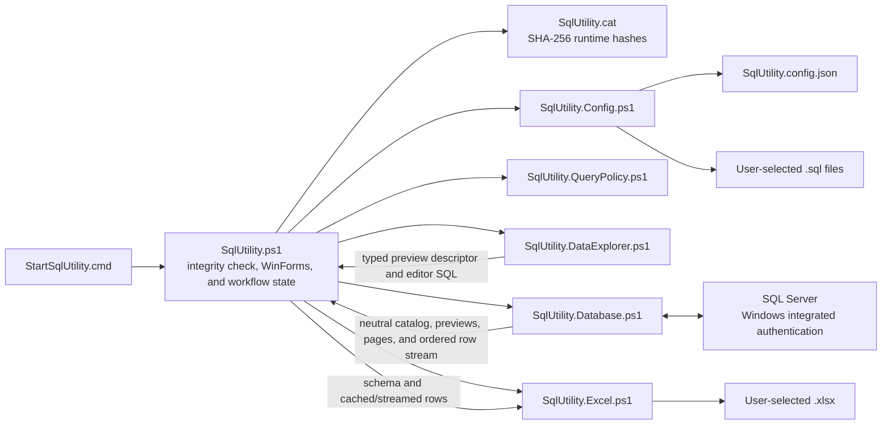

# SQL Utility

## Overview

SQL Utility is a portable internal Windows desktop application for connecting to Microsoft SQL Server with the signed-in user's Windows identity. It provides a constrained Data Explorer, a deliberately restricted read-only query workspace, bounded result paging, and dependency-free `.xlsx` export.

Version 1 is intentionally small and synchronous. It is designed to be copied into a Citrix/cloud-drive environment and launched without installation, administrator access, executable compilation, or third-party packages.

## Version 1 Features

- Connection-first startup with blank Server and Database fields.
- Windows-authenticated connection testing and workspace entry.
- App-local persistence of successful server/database pairs and global settings.
- Explicit SQL template file saving/loading in Query, with an application-local default Templates folder.
- Saved-connection selection and confirmed deletion.
- Data Explorer, Query, and Settings tabs available after connection.
- Physical-table discovery, checked output columns, typed `AND` filters, bounded unordered previews, preview-only export, and safe generated-SQL handoff to Query.
- One read-only `SELECT` statement over a primary named table with optional chained named-table `INNER JOIN` and `LEFT JOIN` clauses.
- Server-side paging for queries with a top-level `ORDER BY`.
- Bounded retrieval and local display paging for unordered queries.
- Fixed 500-row display pages.
- Explicit, on-demand exact row counts when a total is not already known from a complete unordered cache.
- Complete-result `.xlsx` export with a bold, filtered, frozen header row.
- Configurable preview-row limit, unordered-row limit, retained-result data limit, and Query/Export timeout.

## Requirements and Portability

The application targets Windows PowerShell 5.1 and .NET Framework components normally present in the Citrix environment:

- `System.Windows.Forms`
- `System.Drawing`
- `System.Data.SqlClient`
- `System.IO.Compression`
- `System.Xml`
- Built-in PowerShell JSON commands

It requires no installer, compiled `.exe`, administrator rights, third-party PowerShell module, NuGet package, Microsoft Office installation, `sqlcmd`, or Python runtime. It does not write to the registry or modify environment variables.

Microsoft Excel is not required to generate workbooks. Excel or another compatible spreadsheet application is needed only to open and visually inspect an exported `.xlsx` file.

## Portable Distribution

The runtime distribution contains exactly eight files:

```text
StartSqlUtility.cmd
SqlUtility.ps1
SqlUtility.cat
Templates/  (initially empty)
modules/
  SqlUtility.Config.ps1
  SqlUtility.QueryPolicy.ps1
  SqlUtility.DataExplorer.ps1
  SqlUtility.Database.ps1
  SqlUtility.Excel.ps1
```

Keep this structure intact. `SqlUtility.ps1` validates the seven protected command/script files against the SHA-256 hashes in `SqlUtility.cat`, then loads every module relative to its own directory. The folder can therefore be moved without installation or module registration.

`SqlUtility.config.json` is not part of the distribution. The application creates it beside `SqlUtility.ps1` only when a successful connection or settings change needs to be persisted.

Packages include an empty `Templates/` directory, never personal `.sql` files from the source checkout. Form initialization creates this directory if missing and preserves existing contents. Template files are mutable user data, excluded from Git and the runtime catalog.

## Running the Application

1. Extract or copy the complete application folder to the target environment. Do not run it from inside a ZIP archive.
2. Ensure the application directory is writable if saved connections or settings should persist.
3. Launch `StartSqlUtility.cmd`.

The launcher starts `powershell.exe` with:

```text
-NoLogo -NoProfile -STA -ExecutionPolicy Bypass
```

The first PowerShell session hides the console shared with `StartSqlUtility.cmd`, then starts `SqlUtility.ps1` in a second PowerShell 5.1 session with the same portable flags and waits for it to exit. A command window may therefore appear briefly during startup, but it does not remain visible while the application is open.

The execution-policy override is process-only. It does not change the machine, user, registry, or environment configuration. The launcher resolves `SqlUtility.ps1` beside itself even when it is started from another working directory, requests catalog verification before any production module is loaded, and returns the application's exit code. A missing catalog, missing protected file, or hash mismatch produces an integrity-check error and exit code `2`.

## Building a Distribution Package

Maintainers create a ZIP package from the repository root with:

```powershell
powershell.exe -NoLogo -NoProfile -ExecutionPolicy Bypass -File .\scripts\New-SqlUtilityPackage.ps1 -DestinationPath C:\Path\SQL-Utility.zip
```

The destination directory must already exist and the destination ZIP must not. The script checks the seven protected runtime paths, refreshes the source-controlled version-2 SHA-256 `SqlUtility.cat` only when it no longer matches them, stages exactly the eight runtime files, validates the staged copy, and moves a completed ZIP into place. It uses only Windows PowerShell 5.1 and .NET Framework components.

## User Workflow

1. **Choose a connection.** Enter Server and Database manually, or select a saved pair from the list. Both input fields start blank on every launch; selecting a saved pair fills them without connecting automatically.
2. **Test or connect.** **Test Connection** validates the database and shows a success/failure pop-up without entering the workspace. **Connect** performs the same validation and then opens the workspace. A successful pair is added to the saved list and the application attempts to persist it.
3. **Manage saved pairs.** Select a saved pair and use **Delete**. Deletion requires confirmation and updates the active configuration only after a successful write.
4. **Explore a table.** Open Data Explorer to load visible physical user tables. Default-schema tables appear by table name, while other schemas appear as `schema.table`, without SQL identifier brackets. Filter the displayed names in memory or use **Refresh** to re-query the catalog. Selecting a table does not query its columns or rows.
5. **Preview selected data.** Select a table and choose **Preview**. The first preview loads its columns, selects all output columns, and returns at most the configured preview-row limit. Later previews use the checked output columns and any structured `AND` filters. Preview rows are unordered and can differ between executions.
6. **Export or hand off a preview.** **Export Preview** writes exactly the displayed bounded preview snapshot without re-running SQL. **Send to Query** generates editable single-table SQL from the current builder, confirms before replacing nonblank editor text, switches to Query, and does not execute it.
7. **Run a query.** Enter an allowed SQL statement in the Query tab and select **Execute**. Results appear in a read-only grid below the editor. The single-line toolbar is ordered **Execute** | `ORDER BY required for paging.` | page status | **Count** | **<** | **>** | **Export**. The `<` and `>` controls mean Previous page and Next page; **Export** means Export to Excel.
8. **Page results.** Use `<` and `>`. The exact behavior depends on whether the executed query contains a top-level `ORDER BY`.
9. **Count rows when needed.** **Count** is always explicit; it never runs automatically during execution or paging. It is available only for a current successful result while the application is not busy and the editor is not stale. Complete unordered results already show their exact cached total and disable **Count**. Truncated unordered results show the configured retained limit with `+` until counted, while ordered results omit a total until **Count** succeeds; after counting an ordered or truncated result, **Count** remains available for an explicit refresh.
10. **Export a complete Query result.** Use **Export** when enabled and choose an `.xlsx` destination. This existing complete-result workflow is unchanged and is separate from bounded **Export Preview**. The destination is never remembered.
11. **Change global settings.** The Settings tab controls the preview-row limit, maximum unordered rows, retained-result data limit, and Query/Export timeout. Changes become active only after **Save Settings** succeeds.
12. **Change connection.** **Change Connection** warns that the current SQL and results will be lost. Confirmation clears transient Query and Data Explorer state and returns to the connection stage; saved pairs and global settings remain.

The application does not keep an idle database connection open. Connection tests, Data Explorer catalog/preview actions, query pages, and ordered exports open and deterministically dispose their own SQL resources.

## Architecture and Implementation



| File | Responsibility |
| --- | --- |
| `SqlUtility.cat` | Generated version-2 Windows file catalog containing SHA-256 hashes and relative paths for the seven protected runtime command/script files. It excludes mutable configuration and export files. |
| `SqlUtility.ps1` | Validates the runtime catalog when requested by the launcher, then creates WinForms controls, coordinates connection/Data Explorer/query/count/settings/export workflows, owns application, builder, preview-snapshot, and explicit-count state, binds neutral tables, renders status, paging, and user messages, and caps displayed grid columns at 300 pixels. |
| `modules/SqlUtility.Config.ps1` | Creates schema 3 defaults, migrates valid schema 1/2 input in memory, validates settings, loads/writes JSON safely, manages saved pairs, initializes the Templates folder, and reads/writes SQL template text safely. |
| `modules/SqlUtility.QueryPolicy.ps1` | Validates named sources, approved join chains, normalization, primary-table extraction, and top-level ordering; generates count-source/wrapper SQL. |
| `modules/SqlUtility.DataExplorer.ps1` | Validates UI-neutral table/column/filter inputs, maps supported SQL types and operators, quotes catalog identifiers, converts typed values, and builds parameterized preview descriptors and safe editable Query SQL. It has no WinForms or database access. |
| `modules/SqlUtility.Database.ps1` | Builds integrated-security connection strings, tests connections, runs fixed physical-table/column catalog queries, executes typed bounded previews, bounded queries, and scalar counts, constructs neutral results, implements paging, streams ordered exports, enforces command timeouts, and owns SQL resource disposal. |
| `modules/SqlUtility.Excel.ps1` | Converts neutral schema/row input into a safe Open Packaging Convention `.xlsx`, enforces worksheet/text/timeout limits, and replaces the destination only after package completion. It never owns SQL connections. |

Interactive database operations return neutral `DataTable` and page-metadata objects; the database module never renders WinForms controls. Ordered export crosses a callback-based neutral schema/row boundary. Complete unordered export uses the bounded in-memory cache. This separation keeps SQL resource ownership in the database module and workbook generation in the Excel module.

The query workspace uses native Windows visual styles with Segoe UI 9-point interface chrome and a Consolas 10-point SQL editor. It opens with the output viewer taller than the editor, and its 10-pixel result splitter remains user-draggable for remote environments. Result columns are sized from the currently displayed page and automatically capped at 300 pixels; horizontal scrolling remains available. No dark theme, external resource, or custom widget framework is added.

## Configuration and Persistence

The application stores configuration beside `SqlUtility.ps1`:

```text
SqlUtility.config.json
```

Schema version 3:

```json
{
  "schemaVersion": 3,
  "unorderedRowLimit": 1000,
  "queryExportTimeoutSeconds": 120,
  "previewRowLimit": 100,
  "resultDataLimitMiB": 256,
  "connections": [
    {
      "server": "server-name",
      "database": "database-name"
    }
  ]
}
```

Configuration rules:

- `unorderedRowLimit`: integer from `100` through `2000`; default `1000`.
- `queryExportTimeoutSeconds`: integer from `5` through `3600`; default `120` seconds.
- `previewRowLimit`: integer from `10` through `500`; default `100`.
- `resultDataLimitMiB`: integer from `128` through `1024`; default `256` MiB.
- SQL connection timeout: fixed at `10` seconds and separate from Query/Export timeout.
- Saved server/database combinations are unique case-insensitively while preserving the latest entered casing.
- A missing file returns unsaved defaults in memory and is not created by reading.
- Valid legacy schema version 1 input receives `previewRowLimit = 100` and `resultDataLimitMiB = 256`; valid schema version 2 input preserves `previewRowLimit` and receives `resultDataLimitMiB = 256`. Both migrate in memory without a read-time rewrite. The next successful connection or settings save persists the complete schema 3 object.
- Malformed JSON or an invalid schema is classified as configuration corruption and may be reset only after confirmation.
- An unsupported future schema version, locked file, access failure, invalid path, or other environmental read error is reported and exits without offering a destructive reset.

Writes validate and serialize the complete configuration to a unique app-local temporary file. An existing destination is replaced using a unique non-null sibling backup. A pre-commit failure preserves the old file. If the new file is already committed but backup cleanup fails, the save remains successful, a warning is shown, and the recoverable backup may remain for later cleanup.

The configuration never stores:

- Usernames, passwords, tokens, or complete connection strings.
- Query text, query history, or results.
- Data Explorer table choices, metadata, output selections, filters, generated SQL, or preview data.
- Active connection selection or last selected saved pair.
- Export destinations.
- Window position, size, or other UI state.

## SQL Template Files

The [SQL Template Files design](docs/superpowers/specs/2026-09-16-sql-templates-design.md) owns this persistence extension. Query provides Load Template and Save Template above its editor. Each fresh file dialog starts in `Templates/` beside `SqlUtility.ps1`, permits external directories, and restores the process working directory. Neither paths nor filenames are saved in configuration; schema 3 is unchanged.

Saving retains exact editor text, including whitespace, values, comments, and unfinished placeholders, as UTF-8 with a BOM. Blank saves are disabled. Loading accepts UTF-8 and BOM-marked Unicode, rejects invalid encoding/NUL text, reads fully before confirming editor replacement, and never queries metadata, switches connections, or executes SQL. A changed editor follows the existing stale-result workflow. Cancellation/read failure preserves the previous editor and displayed result. Loaded files are not linked to later editor changes.

The UI owns file selection and overwrite confirmation. The Config module writes a unique temporary sibling, then uses a non-overwriting move for a new destination or replacement with a backup for an approved existing destination. Pre-commit failure preserves the prior file; post-commit cleanup failure returns a warning while reporting the save as successful. Transients use `.SqlUtility.template.<id>.tmp`/`.bak` names only in the destination directory. Failure to create the default folder produces a warning and leaves the application and external file selection available.

## Data Explorer

Data Explorer is a constrained assistant for routine physical-table queries. On first activation it uses a fixed catalog query to list non-system physical user tables visible to the signed-in Windows identity, ordered by schema and table. A `dbo` table is displayed by its bare table name; a table in another schema is displayed as `schema.table`, without identifier brackets. The table-name filter is a case-insensitive in-memory substring filter over those displayed names; **Refresh** is the explicit database re-query. Selecting a table resets its current builder but performs no metadata or row query.

The first **Preview** for a selected table loads catalog-derived column metadata, checks every output column, and executes an unordered `TOP (@PreviewLimit)` query. Later previews use the checked output columns and zero or more structured filters joined only with `AND`; repeated filter columns are allowed and do not need to be selected for output. At least one output column is required. All physical columns can be output, but the first release filters only these families:

Checkbox-glyph clicks, a double-click on column text, Space on the highlighted column, and the **All** and **None** actions change output checks. A single click on column text only moves the highlight. Rapid printable characters form a case-insensitive column-name prefix that resets after one second, falling back to the newest character when the complete prefix has no match without changing any checks.

| SQL type family | Operators |
| --- | --- |
| `char`, `varchar`, `nchar`, `nvarchar` | equals, does not equal, contains, starts with; plus is null/is not null when nullable |
| Integer, decimal, money, floating-point | `=`, `<>`, `>`, `>=`, `<`, `<=`; plus is null/is not null when nullable |
| `date`, `time`, `smalldatetime`, `datetime`, `datetime2`, `datetimeoffset` | `=`, `<>`, `>`, `>=`, `<`, `<=`; plus is null/is not null when nullable |
| `bit`, `uniqueidentifier` | equals, does not equal; plus is null/is not null when nullable |

Binary, rowversion/timestamp, XML, spatial, hierarchy, `sql_variant`, CLR/user-defined, and legacy large-object columns are output-only. Text, numeric, date/time, bit, and GUID input is converted to a typed value before execution. Preview identifiers come only from returned catalog metadata and are bracket-quoted; the preview limit and filter values use explicitly typed `SqlParameter` descriptors rather than `AddWithValue`. Contains and starts-with treat `%`, `_`, and `[` as literal input by using SQL Server bracket escaping before adding application wildcards.

Preview is deliberately bounded, unordered, unpaged, and uncounted. Both SQL `TOP` and the client reader enforce `previewRowLimit`; there is no sentinel or completeness claim. The client also enforces `resultDataLimitMiB` while reading variable-length text and binary values. Exceeding it cancels the read, returns no partial preview, and preserves the prior successful preview snapshot. Large unfiltered tables often return quickly, but absent matches, unindexed or non-sargable filters, wide/large values, server load, and storage behavior can still cause scans or timeouts. The Query/Export timeout applies.

Builder state and the displayed preview snapshot are independent. Changing the selected table, columns, filters, or preview-row setting does not change or mark the last successful preview stale. A failed metadata, validation, query, rendering, or export action preserves that snapshot. **Export Preview** always exports exactly the displayed snapshot without database work, while **Send to Query** always generates single-table SQL from the current builder. The generated editor SQL omits `TOP`, `ORDER BY`, and paging, and later execution still passes through the unchanged QueryPolicy workflow.

## Query Policy

Version 1 accepts one statement with this logical shape:

```sql
SELECT [DISTINCT] expressions
FROM [schema.]table [alias]
{
    [INNER] JOIN [schema.]table [alias] ON predicate
  | LEFT [OUTER] JOIN [schema.]table [alias] ON predicate
} [...]
[WHERE predicate]
[GROUP BY expressions]
[HAVING predicate]
[ORDER BY expressions]
```

Representative accepted queries:

```sql
SELECT Id, Description
FROM dbo.Items
WHERE IsActive = 1;
```

```sql
SELECT CategoryId, COUNT(*) AS ItemCount
FROM dbo.Items
GROUP BY CategoryId
HAVING COUNT(*) > 5;
```

```sql
SELECT Id, CAST(CreatedAt AS date) AS CreatedDate
FROM dbo.Items
ORDER BY Id;
```

```sql
SELECT i.Id, c.Name
FROM dbo.Items AS i
INNER JOIN dbo.Categories AS c ON c.Id = i.CategoryId;
```

```sql
SELECT o.Id, c.Name, r.RegionName
FROM dbo.Orders AS o
LEFT OUTER JOIN dbo.Customers AS c ON c.Id = o.CustomerId AND c.Enabled = 1
INNER JOIN dbo.Regions AS r ON r.Id = c.RegionId
WHERE o.CreatedAt >= '2026-01-01'
ORDER BY o.Id;
```

Bare `JOIN` means `INNER JOIN`. Every join requires a nonempty `ON` predicate, which accepts the existing expression/predicate grammar. Normal scalar and aggregate expressions, `CASE`, explicit or implicit aliases, string literals, quoted/bracketed identifiers, balanced nested comments, and dedicated `CAST`/`TRY_CAST` type syntax are supported when they remain inside the approved named-source shape. `TableIdentifier` remains an internal validation result for the primary source; it is not a user-facing multi-source catalog.

The validator rejects:

- `RIGHT JOIN`, `RIGHT OUTER JOIN`, `FULL JOIN`, `FULL OUTER JOIN`, `CROSS JOIN`, `CROSS APPLY`, `OUTER APPLY`, and comma-separated table sources.
- Derived tables, parenthesized table sources, subqueries, nested `SELECT`, common table expressions, table-valued functions, and external or remote rowset functions.
- Temporary tables, table variables, table hints, query hints, three-part or four-part table names, and other cross-database or linked-server sources.
- `UNION`, `INTERSECT`, `EXCEPT`, `TOP`, user-supplied `OFFSET`/`FETCH`, and `INTO`.
- Multiple statements or executable content after the one allowed query.
- Stored procedures, dynamic SQL, data modification, DDL, transaction, permission, and administrative commands.

The tokenizer distinguishes executable tokens from strings, quoted identifiers, bracketed identifiers, line comments, nested block comments, and parenthesis depth. Reserved words and statement starters cannot be consumed as unquoted aliases.

This client-side validator is an accidental-change safeguard, not a security sandbox. SQL Server permissions assigned to the signed-in Windows identity remain the authoritative boundary; use a least-privileged database identity.

Result limits bound transferred and retained rows, not SQL Server join work or intermediate results. A joined query can still scan large sources, produce large intermediate results, sort, group, block, or time out before rows reach the client.

## Query Execution and Paging

Editing the SQL text after a successful execution makes the result stale. Paging and export are disabled until **Execute** succeeds again. Every follow-up action uses the exact last successfully validated query snapshot, never unexecuted editor text.

### Row status and explicit counts

Status reports only information already known from the current result unless the user selects **Count**. A complete unordered cache shows its exact total (for example, `Page 1 - 500 of 723`) and disables **Count**. A truncated unordered cache shows a lower bound such as `Page 1 - 500 of 1000+` until counted. Ordered results initially show only the current page and displayed rows, such as `Page 1 - 500`; an empty first ordered page shows `Page 1 - 0 of 0` without a count query. An empty later ordered page does not establish a zero total.

**Count** runs a separate scalar query using the configured Query/Export timeout. It can be expensive for large or complex result sets, and its result is a point-in-time value that can drift if data changes between it and page retrieval. The generated count preserves `DISTINCT`, `WHERE`, `GROUP BY`, and `HAVING`, and ignores only the validated top-level display `ORDER BY`; no count query, total-page calculation, or arbitrary-page navigation is implicit.

### Ordered queries

For a query with a top-level `ORDER BY`, the database module appends application-controlled, parameterized `OFFSET` and `FETCH` clauses:

- Visible page size: `500` rows.
- Fetch size: `501` rows.
- The 501st row is a sentinel used only to decide whether `>` (Next page) is available.
- Page navigation re-executes the ordered query with the requested offset.
- No count query, total-row count, or total-page calculation is performed automatically.

Use a stable, preferably unique ordering. Ties or underlying data changes between page requests can change row placement.

### Unordered queries

For a query without top-level `ORDER BY`, the application executes the original query and reads at most `unorderedRowLimit + 1` rows. The additional row is only a truncation probe:

- If no probe row appears, the result is complete.
- If it appears, only the probe row is discarded; the configured maximum remains available to the user.
- Retained rows are cached in memory and displayed in local 500-row pages.
- A truncated result triggers a notification asking for `ORDER BY` and disables complete-result export.

The cap bounds transferred and retained rows, but it cannot prevent SQL Server from performing an expensive scan, aggregation, or sort before returning rows.

### Retained-result data limit

Interactive ordered pages, unordered caches, and Data Explorer previews use `CommandBehavior.SequentialAccess`. Text and binary lengths are checked before materialization, and a conservative allocation budget accounts for retained payload plus the temporary UTF-16 buffer needed to construct strings. If the next value would exceed `resultDataLimitMiB`, the command is cancelled where possible and the operation fails without returning a partial `DataTable`. The user is asked to review selected columns and filters.

This setting is not an exact process-memory ceiling. `DataTable`, WinForms controls, fixed-width values, object metadata, and other application state add overhead beyond the measured text/binary allocation budget.

## Excel Export

Query-tab **Export** is enabled only for a current successful result that can be exported completely; this existing complete-result behavior is unchanged:

- An ordered query is re-executed from its exact validated snapshot and streamed from a fresh Windows-authenticated connection into the workbook.
- A complete unordered result exports every cached row.
- A truncated/incomplete unordered result is rejected before the Save dialog or exporter is invoked.
- Stale, failed, or never-executed results cannot be exported.

The dependency-free exporter creates one worksheet named `Results` with:

- A bold header row.
- AutoFilter over the used range.
- The header row frozen.
- Numeric, Boolean, and supported date/time values written with appropriate Excel types/styles.
- Database nulls written as empty cells.
- Formula-looking strings kept as literal text.
- `byte[]` values written as deterministic uppercase hexadecimal text with a `0x` prefix.
- Years `0001` through `0099` written as invariant ISO text instead of invalid OLE Automation dates.
- Literal OOXML escape-shaped text and XML-invalid UTF-16/control units safely encoded.

Excel limits enforced by version 1:

- Maximum text value: `32,767` UTF-16 code units. Longer source values fail explicitly rather than being silently truncated.
- Maximum binary value: `16,382` bytes, because its `0x`-prefixed hexadecimal representation must fit the same Excel text-cell limit.
- Maximum data rows: `1,048,575` plus one header row.
- One worksheet only; overflow is an error rather than a partial multi-sheet export.

The Query/Export timeout applies to SQL streaming and overall workbook generation. Ordered export uses sequential reader access and checks text/binary cell lengths before materializing each value; it does not apply the cumulative retained-result limit because rows are streamed rather than cached. The exporter writes to a unique temporary file beside the selected destination. An existing workbook is replaced only after the new package closes successfully, using a unique non-null sibling backup. Failures preserve the prior destination and clean transient files where possible.

Data Explorer **Export Preview** uses the same neutral cached-table exporter and safety rules, but it exports only the exact bounded preview snapshot already displayed. It does not re-run SQL and does not claim a complete table or query result.

## Security and Data Boundaries

- Authentication uses Windows integrated security only.
- The application never accepts, logs, or persists credentials.
- `SqlConnectionStringBuilder` constructs SQL connection strings.
- Application-generated paging values are SQL parameters.
- Data Explorer table and column identifiers come from fixed physical-table catalog queries; preview limits and filter values use explicit typed SQL parameters.
- Query-tab execution and export use only the normalized snapshot approved by QueryPolicy; Data Explorer preview execution uses only the validated parameterized descriptor built from returned catalog metadata.
- Query text is persisted only through explicit Save Template actions; results, caches, Data Explorer builder/snapshot state, and the active connection exist only in process memory.
- Automatic persistent writes are limited to validated `SqlUtility.config.json` plus same-directory safe-write transients and creation of the default Templates directory.
- Template text files and their safe-write transients are written only to the user-selected destination directory.
- Excel files and their safe-write transients are written only to the user-selected destination directory.
- The application performs no registry or environment-variable writes.
- SQL Server connection/query traffic is the application's only automatic network protocol.
- Startup catalog validation detects accidental changes to the seven protected runtime files. The catalog is currently unsigned, so it does not authenticate the publisher or prevent someone from deliberately regenerating both the files and catalog.

## Error Handling and Runtime Model

Version 1 performs work synchronously to keep the PowerShell implementation small and portable. During connection, query, paging, configuration, and export actions, the UI disables re-entry, shows status, and restores controls in `finally` paths. The window may be temporarily unresponsive while SQL or workbook work is running.

- Connection and diagnostic command timeout: fixed `10` seconds.
- Query/Export timeout: configurable from `5` through `3600` seconds.
- Retained-result data limit: configurable from `128` through `1024` MiB; default `256` MiB.
- Query or page failure clears the current result, page, and export state and reports the error.
- Export failure preserves a previously existing destination until a complete replacement is ready.
- Configuration writes preserve pre-existing bytes on pre-commit failure.
- Delete, Change Connection, configuration reset, and export overwrite require confirmation at the appropriate boundary.
- No operational log file is written in version 1.

## Testing

Tests are dependency-free PowerShell scripts and do not require a live SQL Server or Microsoft Excel installation.

| Test file | Coverage |
| --- | --- |
| `tests/Test-Helpers.ps1` | Shared assertions and test completion behavior. |
| `tests/Test-Config.ps1` | Defaults, schema 1/2 migration, schema 3 ranges, saved pairs, corruption classification, and safe persistence. |
| `tests/Test-Templates.ps1` | Folder initialization, SQL/Unicode text round trips, external paths, overwrite permission, failure preservation, and post-commit cleanup warnings. |
| `tests/Test-QueryPolicy.ps1` | Accepted grammar including JOIN chains, bypass-focused named-source/join rejection, statement boundaries, aliases, comments, and cast syntax. |
| `tests/Test-DataExplorer.ps1` | Type/operator matrix, typed conversion, identifier/literal safety, parameterized preview descriptors, and QueryPolicy-compatible generated editor SQL. |
| `tests/Test-Database.ps1` | Integrated connection strings, physical-table/column catalog queries, sequential large-value reads, retained-result and Excel-cell limits, paging, neutral result conversion, timeouts, cancellation, and disposal boundaries. |
| `tests/Test-Excel.ps1` | ZIP/XML workbook structure, formatting, data fidelity, limits, overwrite safety, timeout, and cleanup. |
| `tests/Test-SqlUtilityUi.ps1` | WinForms stages, Data Explorer workflows and snapshot boundaries, state transitions, injected services, paging, export eligibility, settings, and failure paths. |
| `tests/Test-Launcher.ps1` | Exact eight-file distribution, catalog validation, relative module loading, launcher behavior, Windows PowerShell 5.1 syntax, STA/process policy, external working directory, and mutation boundaries. |
| `tests/Test-Packaging.ps1` | Real package creation in a disposable project copy, catalog validation after clean Git checkouts with either `core.autocrlf` setting, exact ZIP contents, catalog refresh, extracted validation, and changed-file detection. |
| `tests/Test-All.ps1` | Aggregate runner for every production suite. |

Focused examples:

```powershell
powershell.exe -NoLogo -NoProfile -ExecutionPolicy Bypass -File .\tests\Test-DataExplorer.ps1
powershell.exe -NoLogo -NoProfile -ExecutionPolicy Bypass -File .\tests\Test-QueryPolicy.ps1
powershell.exe -NoLogo -NoProfile -STA -ExecutionPolicy Bypass -File .\tests\Test-SqlUtilityUi.ps1
```

Full verification:

```powershell
powershell.exe -NoLogo -NoProfile -STA -ExecutionPolicy Bypass -File .\tests\Test-All.ps1
```

## Citrix Acceptance Checklist

These are external acceptance checks. Local automated tests do not complete them. Citrix launch, live SQL Server behavior, cloud-drive configuration reload, and desktop Excel opening remain pending until performed in that environment.

- [ ] Copy/extract the eight runtime files and launch `StartSqlUtility.cmd` in Citrix.
- [ ] Confirm an unchanged package starts, then confirm a test copy with one modified module is rejected by the catalog check.
- [ ] Test and persist a real Windows integrated server/database connection.
- [ ] Verify automatic/refresh physical-table discovery and metadata visibility under the signed-in identity.
- [ ] Preview representative large, wide, indexed, and unindexed tables and verify bounded rows, unordered labeling, filters, and timeout behavior.
- [ ] Send representative SQL types and collations to Query and execute the generated SQL.
- [ ] Save/load SQL templates in Citrix, including Unicode text, overwrite refusal, cloud-drive failures, external directories, and both dialogs returning to Templates after browsing elsewhere.
- [ ] Load representative schema 1 and schema 2 configurations, then verify schema 3 migration and reload from the application directory/cloud drive after a successful save.
- [ ] Verify the result data limit against representative `nvarchar(max)` and `varbinary(max)` values: no partial result is displayed, and reducing selected columns or filters allows retry.
- [ ] Run representative complete unordered, truncated unordered, and ordered `INNER JOIN`, `LEFT JOIN`, and mixed chained-join queries.
- [ ] Verify ordered joined-result paging with a stable unique `ORDER BY`, including a page beyond the first 500 rows and back.
- [ ] Run an explicit Count for an ordered joined result.
- [ ] Verify an unordered joined result at the row limit is truncated and cannot export; export a complete joined result and open the workbook in desktop Excel.
- [ ] Export Preview, verify overwrite behavior and the exact bounded snapshot row count, and open the workbook in desktop Excel.
- [ ] Verify an unsupported `RIGHT JOIN` is rejected before a database call, and a valid-shape query with an unknown or ambiguous column reports a server-side Query Error.
- [ ] Confirm the header is bold, filtered, and frozen and representative cell types are correct.
- [ ] Confirm the application creates only the default Templates directory, app-local configuration/transients, and explicitly selected SQL template/Excel files with same-directory transients.

## Version 1 Limitations

- One primary one- or two-part named source with optional chained bare/`INNER JOIN`, `LEFT JOIN`, or `LEFT OUTER JOIN` units; no other join/apply forms, derived sources, subqueries, CTEs, set operators, or SQL batches.
- Data Explorer lists physical user tables only; it does not browse views or provide arbitrary SQL filters, `OR`/grouping, paging, sorting controls, counts, or complete-result export.
- Data Explorer previews are bounded and unordered, and builder changes do not mark the displayed snapshot stale.
- One result set, one Query tab, one Data Explorer preview snapshot, and one active server/database pair.
- Synchronous UI with no background runspace, cancellation button, or detailed progress.
- No automatic query history, result persistence, or operational log. Templates are plain SQL starting points with manual values and no database binding or synchronization.
- No automatic total-row or total-page count; **Count** is an explicit point-in-time operation.
- No SQL authentication or credential storage.
- One Excel worksheet; results above worksheet limits stop with an error.

## Future Extensions

Future query-policy work remains limited to separately designed extensions such as `RIGHT`/`FULL`/`CROSS JOIN`, `APPLY`, derived sources, subqueries, CTEs, set operators, table functions, cross-database sources, and guarded `UPDATE`. View browsing, more expressive Explorer filters, background execution, and additional functional tabs also require separate approval; they are not current commitments.

Any scope expansion should preserve least-privilege SQL permissions, explicit grammar validation, complete-result export rules, portable runtime constraints, and regression coverage.

## Design References

- [SQL Utility Version 1 Design](docs/superpowers/specs/2026-08-02-sql-utility-v1-design.md)
- [SQL Utility Version 1 Implementation Plan](docs/superpowers/plans/2026-08-02-sql-utility-v1.md)
- [Project Documentation Design](docs/superpowers/specs/2026-08-05-project-documentation-design.md)
- [SQL Utility Data Explorer Design](docs/superpowers/specs/2026-08-14-sql-utility-data-explorer-design.md)
